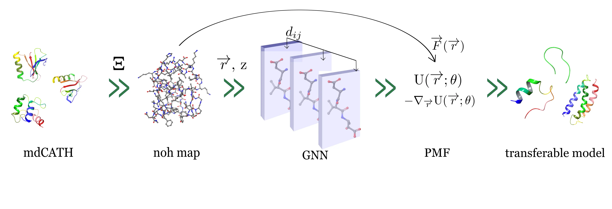

# AMARO: Advanced Machine-learning Atomic Representation Omni-force-field

We introduce AMARO (Advanced Machine-learning Atomic Representation Omni-force-field), a novel neural network potential that integrates the O(3)-equivariant message-passing TensorNet architecture with a hydrogen-excluding coarse-graining approach. AMARO demonstrates the feasibility of training coarser NNP, without
prior energy terms, to run stable protein dynamics with scalability and generalization capabilities. 

> AMARO version 1.0.0
- paper: 
    add here the arxiv link  
    AMARO: All Heavy-Atom Transferable Neural Network Potentials of Protein Thermodynamics. 

